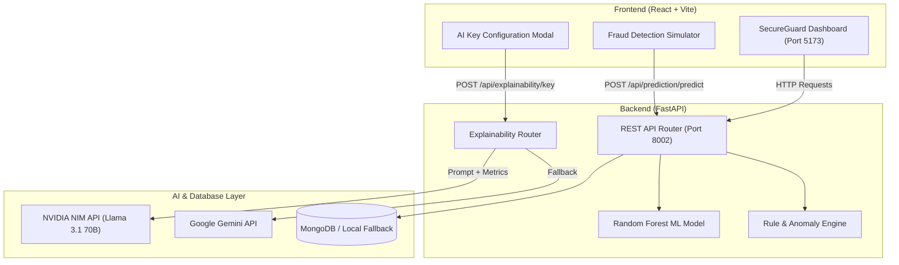

# 🛡️ SecureGuard AI — Real-Time Fraud Detection & Explainable AI Platform


> 🔗 **GitHub Repository**: [https://github.com/abhinay0804/SecureGuardAI](https://github.com/abhinay0804/SecureGuardAI)
>
> **SecureGuard AI** is a state-of-the-art enterprise fraud detection platform that combines **Hybrid Machine Learning & Rule-based Risk Scoring** with **NVIDIA NIM LLM Explainability** (`meta/llama-3.1-70b-instruct`). It empowers financial risk analysts to detect high-risk transactions in real-time and understand *why* a transaction was flagged through human-readable AI explanations.

---

## 🌟 Key Highlights & Features

- ⚡ **Hybrid Risk Engine**: Combines trained ML classification models (Random Forest / XGBoost) with customizable velocity and anomaly business rules.
- 🧠 **NVIDIA NIM LLM Explainability**: Uses NVIDIA NIM (`meta/llama-3.1-70b-instruct`) to generate clear, structured explanations featuring **Key Drivers**, **Risk Assessment**, and **Next Actionable Steps** for fraud operations.
- 🔄 **Dual LLM Provider Support**: Supports both **NVIDIA NIM** and **Google Gemini** with instant dynamic provider switching.
- 🔑 **Interactive AI Key Management**: Includes an on-screen API key configuration modal allowing evaluation panel members to easily plug in their own free NVIDIA or Gemini API key.
- 📊 **Real-Time Analytics Dashboard**: Visualizes high-level KPIs, fraud trends by date/time, channel distributions (ATM, Mobile, POS, Web), and real-time risk alerts.
- 🛡️ **Zero Key Leakage Security**: API keys and environment secrets are kept strictly local (`.env`, `.nvidia_explain_key`, `.gemini_explain_key`) and ignored by git repository tracking.

---

## 🏗️ System Architecture



---

## 🛠️ Technology Stack

| Layer | Technologies |
| :--- | :--- |
| **Frontend** | React 18, Vite 5, Tailwind CSS, Lucide Icons, Recharts, React Router |
| **Backend** | Python 3.11, FastAPI, Uvicorn, Pydantic, Scikit-Learn, PyMongo, Requests |
| **Machine Learning** | Scikit-Learn Random Forest Classifier, Feature Engineering Pipeline |
| **AI Explainability** | NVIDIA NIM API (`meta/llama-3.1-70b-instruct`), Google Gemini (`gemini-2.5-flash`) |
| **Database & Cache** | MongoDB (with graceful local mock database fallback), Redis (optional) |

---

## 📂 Project Structure

```text
.
├── backend/
│   ├── data/                   # Dataset files (transactions data)
│   ├── models/                 # Trained Random Forest model pickle artifacts
│   ├── src/
│   │   └── utils/
│   │       └── fraud_dashboard/
│   │           ├── main.py     # FastAPI application entry point
│   │           ├── database.py # MongoDB connection & mock fallback
│   │           ├── routers/    # API endpoints (prediction, explainability, overview, etc.)
│   │           └── cache.py    # Redis caching layer
│   ├── .env.example            # Environment template for backend
│   └── requirements.txt        # Python package dependencies
├── frontend/
│   ├── src/
│   │   ├── components/         # React UI components (AI Key Modal, Tables, Charts)
│   │   ├── services/           # Axios/Fetch API client service
│   │   ├── App.jsx             # Main dashboard application frame
│   │   └── main.jsx            # Vite entry point
│   ├── FraudDetection.jsx      # Interactive Fraud Detection Lab component
│   ├── package.json            # Node.js dependencies
│   └── vite.config.js          # Vite build configuration
├── .env.example                # Root environment template
├── README.md                   # Project documentation
└── .gitignore                  # Git repository exclusion file
```

---

## ⚡ Quick Start Guide (For Judges & Panel Members)

Follow these simple steps to run both the **FastAPI Backend** and **React Frontend** locally.

### Prerequisites

Ensure you have installed:
- **Node.js** (v18.0 or higher) & `npm`
- **Python** (v3.11 or higher) & `pip`
- **Git**

---

### Step 1: Start the Backend API

1. Open a terminal and navigate to the `backend` directory:
   ```bash
   cd backend
   ```

2. Create and activate a Python virtual environment:
   ```bash
   # On Linux / macOS:
   python3 -m venv .venv
   source .venv/bin/activate

   # On Windows (PowerShell):
   python -m venv .venv
   .venv\Scripts\Activate.ps1
   ```

3. Install required Python packages:
   ```bash
   pip install -r requirements.txt
   ```

4. Launch the FastAPI server:
   ```bash
   # Make sure you are in the backend directory with virtual environment activated:
   uvicorn src.utils.fraud_dashboard.main:app --host 0.0.0.0 --port 8002 --reload
   ```

   *The backend server will start at **`http://localhost:8002`** (Swagger API Docs at **`http://localhost:8002/docs`**).*

---

### Step 2: Start the Frontend Dashboard

1. Open a second terminal window and navigate to the `frontend` directory:
   ```bash
   cd frontend
   ```

2. Install Node modules:
   ```bash
   npm install
   ```

3. Start the Vite development server:
   ```bash
   npm run dev
   ```

   *The frontend dashboard will be available at **`http://localhost:5173`**.*

---

### Step 3: Configure AI Explainability Key

You can configure your free AI key in either of two ways:

#### Option A: On-Screen UI (Recommended)
1. Open [http://localhost:5173/](http://localhost:5173/) in your browser.
2. Click **Get Started** and select **Fraud Detection** from the left navigation menu.
3. Click the **"Configure AI Key"** button at the top of the Fraud Detection Simulator.
4. Select **NVIDIA NIM** (or **Google Gemini**) and paste your API key.
   - *Get a free NVIDIA API key at [build.nvidia.com](https://build.nvidia.com/)*.
   - *Get a free Gemini API key at [aistudio.google.com](https://aistudio.google.com/)*.
5. Click **Save API Key**.

#### Option B: Environment Variables
Create a `.env` file inside the `backend` directory:
```env
NVIDIA_API_KEY=your_nvidia_api_key_here
```

---

## 🧪 Testing the Fraud Simulator

To evaluate the system in real time:

1. Open the **Fraud Detection** page in the dashboard ([http://localhost:5173](http://localhost:5173)).
2. **Submit a High-Risk Transaction Test**:
   - Customer ID: `CUST_TEST_01`
   - KYC Verified: `No (0)`
   - Account Age: `2 days`
   - Transaction Amount: `$15,000.00`
   - Channel: `Web`
3. Click **Run Prediction**.
4. **Observe Results**:
   - **Verdict**: `Fraudulent` (Red Indicator)
   - **Risk Score**: `100.00%`
   - **Rule Reasons**: High customer multiplier, unverified account, new account high value.
   - **LLM Explanation**: Live formatted explanation generated by NVIDIA Llama 3.1 70B detailing Key Drivers, Risk Assessment, and Recommended Analyst Actions.

---

## 📡 Primary API Endpoints

| Endpoint | Method | Description |
| :--- | :--- | :--- |
| `POST /api/prediction/predict` | `POST` | Evaluates transaction payload via ML + Rules and returns risk score & LLM explanation. |
| `GET /api/explainability/key` | `GET` | Returns active LLM provider status (NVIDIA or Gemini). |
| `POST /api/explainability/key` | `POST` | Saves local provider selection and API key securely. |
| `GET /api/overview/stats` | `GET` | Returns top-level platform KPI statistics. |
| `GET /api/analytics/fraud_trend` | `GET` | Returns daily fraud trend aggregation for line charts. |
| `GET /api/filter/transactions` | `GET` | Returns filtered transaction logs with pagination. |

---

## 📄 License

This project is licensed under the MIT License — feel free to use and build upon it for hackathons, research, and enterprise applications.
